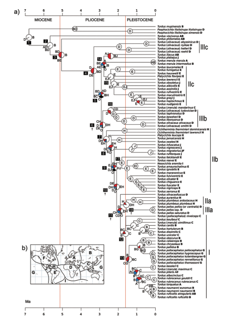
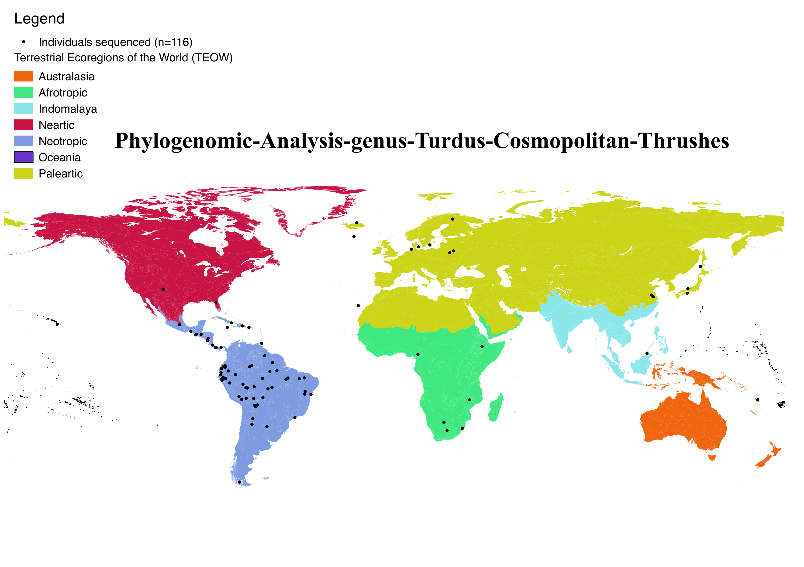

### Authors
---

##### Romina Batista1,2,3, Urban Olsson3,4, Tobias Andermann3,4, Alexandre Aleixo5, Camila Ribas6,†, Alexandre Antonelli3,4,7,†
---

1Programa de Pós-Graduação em Genética, Conservação e Biologia Evolutiva, PPG ([GCBEV](http://gcbev.inpa.gov.br/))  - Instituto Nacional de Pesquisas da Amazônia - INPA ([INPA](http://portal.inpa.gov.br/)) Campus II. Av. André Araújo, 2936 – Petrópolis - CEP 69067-375, Manaus, AM, Brazil

2Instituto Nacional de Pesquisas da Amazônia - INPA ([INPA](http://portal.inpa.gov.br/)) Campus II. Av. André Araújo, 2936 – Petrópolis - CEP 69067-375, Manaus, AM, Brazil

3University of Gothenburg - Department of Biological and Environmental Sciences, [The Antonelli Lab](http://www.antonelli-lab.net/), [Antonelli-Lab Github](https://github.com/AntonelliLab), SE-413 19 Gothenburg, Sweden 

4Gothenburg Global Biodiversity Centre, Box 461, SE-405 30 Gothenburg, Sweden

5Coordenação de Zoologia, Museu Paraense Emílio Goeldi, Belém, Pará, Brazil

6These are both senior authors on this study and have contributed equally.

               

---

### Overview
---

... working in progress ... :soon:

The genus *Turdus* (Aves, Turdidae) consists of 75 currently recognized species occurring throughout the world. Previous attempts to reconstruct phylogenies have proved extremely challenging due to short internal branches and low node support. South and Central America currently host the highest number of species (23 of 75) in the genus Turdus (Aves: Turdidae), and previous studies ([Nylander et al, 2008](http://sysbio.oxfordjournals.org/content/57/2/257.full.pdf+html)) suggest that this is due to an exceptional radiation following dispersal from Africa (see below, Figure 1, from [Nylander et al, 2008](http://sysbio.oxfordjournals.org/content/57/2/257.full.pdf+html)).  

The application of Ultraconserved Elements ([UCEs](http://ultraconserved.org/)) is currently one of the most popular methods for phylogenomics using reduced representation genomic datasets. UCEs are highly conserved across distantly related taxa and have variable flanking regions. These characteristics make UCEs useful genetic markers for both deep and shallow evolutionary timescales, and they have successfully been used to resolve challenging phylogenetic relationships among many taxa (eg. birds, turtles, fishes). 

Here, we sequenced ~2,386 UCEs loci and 108 loci well known and used in previous phylogenetic studies for birds, for 105 individuals of 53/75 species currently recognized for the genus *Turdus* ([Nylander et al., 2008](http://sysbio.oxfordjournals.org/content/57/2/257.full.pdf+html), [Collar et al., 2016 - HB](http://www.hbw.com/)) sampled across its entire distribution (see Fig.2 Americas, Eurasia and African Continents), and 7 individuals as outgroup (*Oenanthae oenanthae*, *Catharus gracilirostris*, *Zoothera dumasi/joiceyi*, *Zoothera dauma*, *Cochoa viridis*, *Ridgwayi pinicola*, *Zoothera citrina albogularis*), to reconstructe a robust phylogeny of the genus using a genomic data set. 

---

### Collaborator Roles
---

*	The Project was conceived and designed by [Romina Batista](http://buscatextual.cnpq.br/buscatextual/visualizacv.do?id=K4232850J7), [Urban Olsson](http://bioenv.gu.se/personal/Olsson_Urban), [Alexandre Aleixo](https://www.researchgate.net/profile/Alexandre_Aleixo), [Alexandre Antonelli](http://www.antonelli-lab.net/) and [Camila Ribas](http://buscatextual.cnpq.br/buscatextual/visualizacv.do?id=K4760723U4). 

*	Romina Batista took care of WetLab at [Gothenburg University](http://bioenv.gu.se): DNA extraction, Library Preparation, Target enrichment and preparation to sent to Sequencing using [Science for Life Laboratory -SciLifeLab](https://ngisweden.scilifelab.se/). 

*	Romina Batista built this repository. ... working in progress ... :soon:

*	Romina Batista is analysing the data, and leading manuscript preparation. ... working in progress ... :soon:

*	All collaborators are involved in discussions, and interpreting results.

---

### Funding
---

Funding for this project came from: 

1. Coordination for the Improvement of Higher Education Personnel (CAPES), A Doctoral Fellowship for Interneship abroad to Romina Batista. 

2. The Antonelli Lab (funding provided to Alexandre Antonelli from the European Research Council under the European Union’s Seventh Framework Programme [FP/2007-2013, ERC Grant Agreement n. 331024], the Wallenberg Foundation for a  Wallenberg Academy Fellowship, and the Swedish Research Council [2015-04857]).  

3. NATIONAL SCIENCE FOUNDATION and FUNDAÇÃO DE AMPARO À PESQUISA DO ESTADO DE SÃO PAULO - FAPESP: 2012/50260-6, TITLE OF THE PROJECT "ASSEMBLY AND EVOLUTION OF THE AMAZONIAN BIOTA AND ITS ENVIRONMENT: AN INTEGRATED APPROACH". Principal Investigators (PI): [Lúcia Lohmann](http://lattes.cnpq.br/3340828165410597)
(IB-USP) e [Joel Cracraft](http://www.amnh.org/our-research/staff-directory/joel-l.-cracraft/) (AMNH).

---

### Acknowledgements
--- 

We would like to thank the many institutions that provided tissue loans for this research: 

*	Instituto Nacional de Pesquisas da Amazônia, INPA, Manaus, Brazil ([INPA](https://www.inpa.gov.br/));

*	Field Museum of Natural History, Louisiana State University Museum of Natural Science, Louisiana State, USA ([LSU](http://www.museum.lsu.edu/MNS/birdcoll.html)); 

*	Museu Paraense Emílio Goeldi, MPEG, Belém, PA, Brazil ([MPEG](http://www.museu-goeldi.br/portal/content/coleções-de-científicas)); 

*	Laboratório de Genética e Evolução Molecular de Aves, Departamento de Genética e Biologia Evolutiva do Instituto de Biociências da Universidade de São Paulo-USP ([LGEMA](http://www.ib.usp.br/biologia/lgema/)); 

*	Divisão de Aves do Museu de Zoologia da Universidade Estadual de Feira de Santana, DAMZFS, Feira de Santana, Bahia, Brazil;

*	American Museum of Natural History, New York, NY, USA ([AMNH](http://www.amnh.org/science/divisions/vertzoo/#collections));

*	Burke Museum, Seattle, WA, USA ([UWBM](http://www.burkemuseum.org/));

*	Göteborgs Naturhistoriska Museum, Gothenbur, SE ([GNM-Av.ex.](http://www.gnm.se/)).

* The authors acknowledge support from [Science for Life Laboratory](https://www.scilifelab.se/), the Knut and Alice Wallenberg Foundation, the National Genomics Infrastructure funded by the Swedish Research Council [NGI](https://www.scilifelab.se/platforms/ngi/), and Uppsala Multidisciplinary Center for Advanced Computational Science for assistance with massively parallel sequencing (alternatively genotyping) and access to [Uppmax](https://www.scilifelab.se/facilities/uppnex/) computational infrastructure. 

* We also would like to thank [Mats Töpel](http://matstopel.se/), for his support with bioinformatics computer cluster [Albiorix](http://albiorix.bioenv.gu.se/) at the Department of Biological and Environmental Sciences, University of Gothenburg and his constructive advice that greatly helped to improve this repository and data process.

---

### Notes :pencil2: 

:information_source: Origin of all data 

[SNP&SEQ Technology Platform National Genomics Infrastructure (NGI), Science for Life Laboratory - Uppsala University](http://molmed.medsci.uu.se/SNP+SEQ+Technology+Platform/?languageId=1) 
This sequence was done by SciLifeLab and we received on 2016-08-19

*	Data from 1 MiSeq run (Capture-Library-A) in the sequencing project "Romina Thrushes A and B" (PD-1096) available at Uppmax in the folders: `/proj/b2015096/INBOX/160812_M00485_0289_000000000-ARW1N`

This sequence was done by SciLifeLab and we received on 2016-08-22

* 	Data from 1 MiSeq run (Capture-Library-B) in the sequencing project "Romina Thrushes A and B" (PD-1096) available at Uppmax in the folders: `/proj/b2015096/INBOX/160816_M00485_0290_000000000-ARVCN`

[National Genomics Infrastructure, Stockholm Node, Science for Life Laboratory](https://ngisweden.scilifelab.se/)
 
This sequence was done by SciLifeLab and we received on 2016-08-08

*  Data from 1 MiSeq run (Capture-Library-C) in the sequencing project "A.Antonelli_16_06 (Romina Thrushes C TOEPADS)" available at Uppmax in the folders: `/proj/b2015096/INBOX/A.Antonelli_16_06`

---

:information_source: The data was dowloaded on 24th August 2016 from [UPPMAX](http://www.uppmax.uu.se/) A.Antonelli account to [Albiorix](http://albiorix.bioenv.gu.se/)

---

:+1: Romina Batista checked all .md5 files on Albiorix, 30/08/2016.

---

:cloud: Data stored (30/08/2016) on `/nobackup/data14/romina/turdus-targetcapture/data/Facilities/SciLifeLab/library*` on [Albioix](http://albiorix.bioenv.gu.se/)

:cloud: Data stored (14/07/2017) on `.../.../.../raw_data_SciLifeLab/library*` on personal [Dropbox](https://www.dropbox.com)

---

:on: Analyses running in node0 `/state/partition4/romina/rawdata_SciLifeLab/library*` on [Albioix](http://albiorix.bioenv.gu.se/)

---
